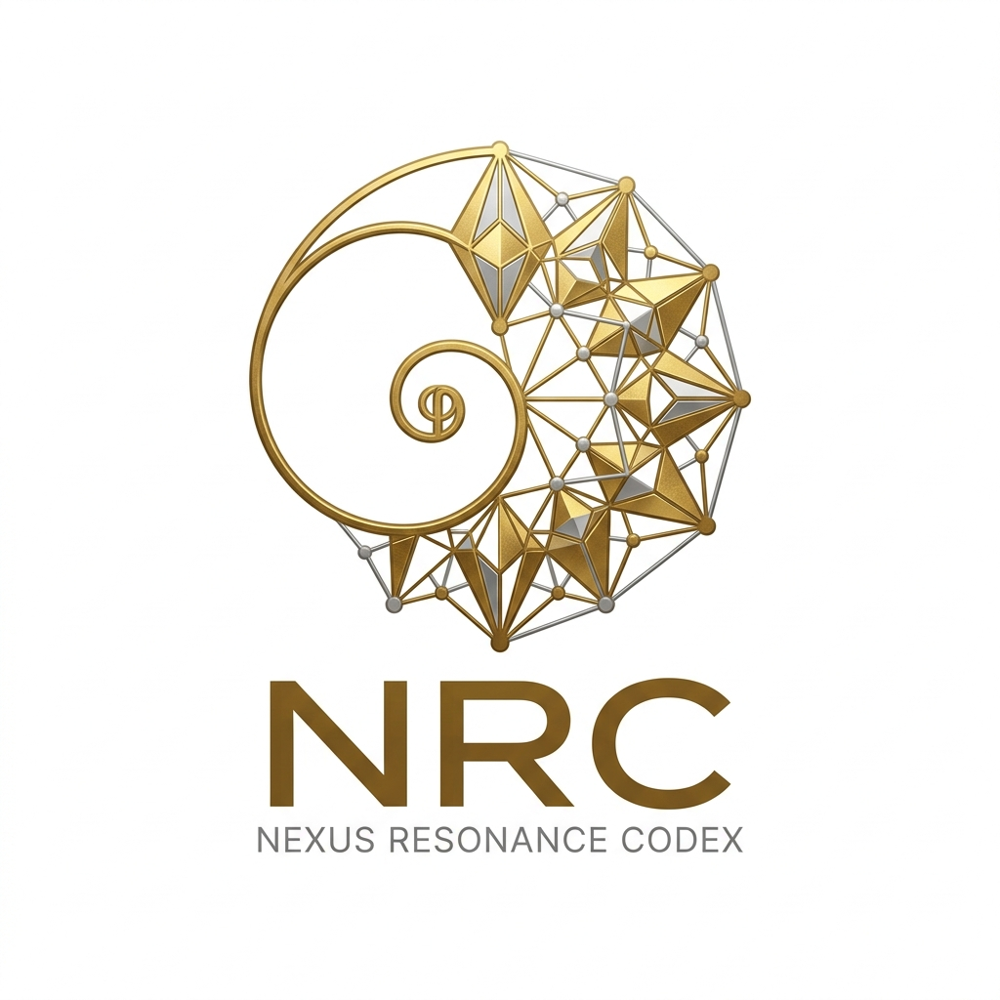

# [Nexus Resonance Codex (NRC)](https://github.com/Nexus-Resonance-Codex)

  

## 📜 Scientific Mission
The **Nexus Resonance Codex (NRC)** is an institutional-grade framework dedicated to the intersection of **High-Dimensional Lattice Resonance**, **Golden-Ratio ($\phi^\infty$) Scaling**, and **TUPT Post-Quantum Cryptography**. Our objective is to establish absolute computational and biological integrity through the application of the **Trageser Tensor Theorem (TTT)**.

## 🧬 Primary Research Tracks
-   **[Protein-Folding](https://github.com/Nexus-Resonance-Codex/Protein-Folding)**: Accelerating bio-lattice integrity and therapeutic discovery.
-   **[Ai-Enhancements](https://github.com/Nexus-Resonance-Codex/Ai-Enhancements)**: High-density attention mechanisms via φ^∞ lattice compression.
-   **[Phi-Infinity-Lattice-Compression](https://github.com/Nexus-Resonance-Codex/Phi-Infinity-Lattice-Compression)**: Post-quantum cryptographic stabilization and modular modularity.
-   **[NRC Math Vault](https://github.com/Nexus-Resonance-Codex/NRC)**: Foundations of High-Dimensional Lattice Resonance and TTT Primitives.

---
*"Absolute integrity through resonance."*
